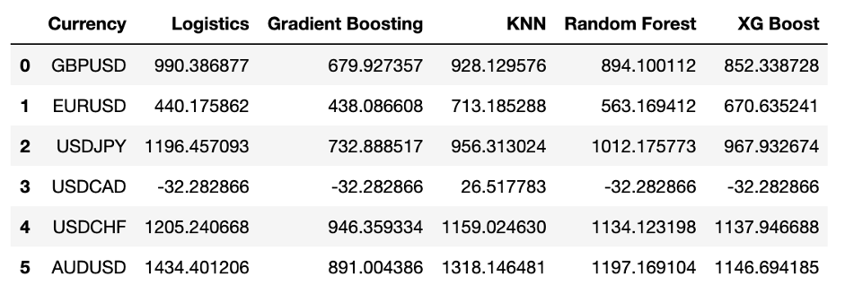

# ForEx_Trading

## 1. Background

Selecting a broker that aligns with your trading strategy requires careful consideration of multiple factors. According to the trading platform EBS, approximately 70 percent of orders on its platform are now algorithmically generated, a significant shift from 2004 when trading was entirely manual. This change highlights the growing importance of quantitative trading in FX investment. Quantitative trading leverages mathematical and statistical models to identify and execute trading opportunities by estimating the probability of outcomes through data-driven analysis. Unlike traditional trading methods, it relies fully on statistical techniques and programming. However, key challenges include limited availability of high-quality FX data compared to equities and the frequent underestimation of the costs associated with acquiring quality data. To address these challenges, we developed a robust model trained on a comprehensive dataset from Polygon.io, comprising one week of minute-level data across six major currency pairs totaling 30,000 rows. We evaluated multiple machine learning models and selected the one with the highest accuracy for deployment. Simulations using real-time data demonstrated strong return potential, and the model also integrates risk assessment to guide each transaction, enhancing decision-making under uncertainty.

## 2. Data Acquisition and Preparation
   
Data Sources
Polygon.io: We obtained high-frequency Tick data for 16 U.S. stocks and dark pool trading, as well as FX rates for several major currency pairs.

Currency Pairs: Based on reports from the Bank for International Settlements and Investopedia, we selected six of the most commonly traded currency pairs:
- GBPUSD
- EURUSD
- USDJPY
- USDCAD
- USDCHF
- AUDUSD

Data Collection Process
We developed a flexible function to retrieve FX rates for the above currency pairs. Users can easily modify the data collection by providing a configuration dictionary with the following fields:
- timespan: Time unit (e.g., minute, hour)
- multiplier: Interval size (e.g., every 6 minutes)
- from: Start date (YYYY-MM-DD)
- to: End date (YYYY-MM-DD)
- currencies: List of currency pairs to fetch
- API Key: Your personal Polygon.io API key

Example configuration:
- timespan: minute
- multiplier: 6
- from: 2021-10-25
- to: 2021-11-27
- currencies: [‘GBPUSD’, ‘EURUSD’, ‘USDJPY’, ‘USDCAD’, ‘USDCHF’, ‘AUDUSD’]
- API Key: API key

Output Data Structure
The data is returned as a four-column DataFrame:
- index: Sequential row index
- timestamp: 13-digit UTC format (later converted to datetime)
- currency pair: The specific FX pair
- fx_rate: Closing rate for each interval

To improve clarity, we convert the raw timestamp to a human-readable datetime format and add it as a new column called date.

Data Storage
Data is saved in MongoDB using the Arctic library, which allows for efficient storage and easy retrieval.
To optimize storage space, the data is also compressed into ZIP format.

Data Volume
For initial model training, we used FX rates at 6-minute intervals from 2021-10-25 to 2021-11-27.
For higher accuracy, we collected 1-minute interval data from 2021-10-25 to 2021-10-29, resulting in approximately 30,000 rows (about 5,000 rows per currency pair)

## 3. Continuous Wavelet Transform (CWT)

After obtaining data from Polygon.io, we calculate the return at each point using the formula 
(T1 rate − T0 rate) / T0 rate. For example, if yesterday’s rate was 0.1 and today’s rate is 0.2, the return is 100% ((0.2−0.1)/0.1). Conversely, if yesterday’s rate was 0.2 and today’s rate dropped to 0.1, the return is -50% ((0.1−0.2)/0.2).
This illustrates an issue: even when price changes are similar in magnitude, the calculated return rates can differ drastically. To prevent these discrepancies from misleading our model, we apply noise reduction techniques to smooth the return data.

We use Continuous Wavelet Transform (CWT) for noise reduction. Wavelet transform decomposes the signal using wavelet bases—functions localized in both time and frequency—which makes it effective at capturing small-scale, transient features in the data. In this project, CWT is applied to the return series to filter out noise and enhance signal quality.

## 4. Clustering
   
(1) Historical Data
Clustering is the process of identifying patterns or similarities within data and grouping similar data points together into clusters. The goal is to ensure that data points within the same cluster are highly similar (high intra-class similarity), while those in different clusters are distinctly different (low inter-class similarity).

Unlike classification, clustering is an unsupervised learning technique, meaning it does not require pre-labeled data. In contrast, classification is a supervised method that relies on labeled examples. Effective clustering should yield groups that are both meaningful and distinct.

For our project, we cluster return data into three categories based on their characteristics:
- Buy Cluster: Returns are positive, indicating potential buying opportunities.
- Sell Cluster: Returns are negative, suggesting selling actions.
- Do Nothing Cluster: Returns are close to zero, implying no action is advisable.

After forming these clusters, we analyze each one by calculating key statistics:
- The average return within each cluster
- The standard deviation of returns
- The average time duration of each cluster

These statistics help us assess the nature and risk of each cluster. A cluster with a positive average return is labeled as a buy cluster, a negative average return as a sell cluster, and an average return near zero as a do-nothing cluster.

(2) Model Training
To further enhance our analysis, we train our data using five machine learning models well-suited for time-series data:
- Random Forest
- XGBoost
- K-Nearest Neighbors (KNN)
- Gradient Boosting
- Logistic Regression

By using the historical returns and their assigned clusters, these models learn the relationships between the return rate (input X) and the cluster label (output Y). This enables the models to predict, for any new return at a future time, which cluster it belongs to and what action—buy, sell, or hold—should be taken.

## 5. Sanity Check

Overfitting happens when a model fits the training data too closely, capturing noise instead of the true underlying patterns. Although a less complex, more generalized model might yield lower accuracy on training data, it usually performs better on new, unseen data. To mitigate overfitting and reliably evaluate model performance, we implemented cross-validation. We partitioned each currency pair’s dataset into 80% for training (4,000 rows) and 20% for testing (1,000 rows), ensuring the test data remained unseen during training. We then iteratively tuned model hyperparameters, retrained on the training subset, and assessed performance against the holdout test set to optimize generalization. Furthermore, we applied a soft clustering technique rather than hard assignments; for each new data point, we calculated probabilistic cluster memberships (e.g., 50% cluster 1, 30% cluster 2, 20% cluster 3) and assigned the point to the cluster with the highest probability. This probabilistic approach improved classification robustness and enhanced downstream analysis.

## 6. Performance Evaluation and Trade Strategy

Finally, we conducted a performance evaluation of our model using real-time FX market data. Beginning with a capital allocation of $10,000, we simulated opening $1,000 positions at each time interval and closing them at the subsequent interval. Across ten simulated trades, we systematically measured the model’s effectiveness, with key performance metrics summarized below.

## 7. Conclusion

Overall, Logistic Regression demonstrated the ability to generate better returns for most currency pairs. However, employing multiple models can optimize returns for specific pairs. In particular, AUD/USD, USD/CHF, and USD/JPY showed improved performance across all models, suggesting that targeted investment strategies based on model strengths can enhance overall returns.

## References

1. Triennial Central Bank Survey – Global Forex Market Turnover for April 2019. Basel, Switzerland: Bank for International Settlements, p. 10, 2019-09-16.

2. What Are the Most Commonly Traded Currency Pairs? [Investopedia](https://www.investopedia.com/ask/answers/06/maincurrencypairs.asp).

3. 8 Proven Ways for Improving the “Accuracy” of a Machine Learning Model. [Analytics Vidhya](https://www.analyticsvidhya.com/blog/2015/12/improve-machine-learning-results/).

4. How (not) to use Machine Learning for time series forecasting: Avoiding the pitfalls. [Towards Data Science](https://towardsdatascience.com/how-not-to-use-machine-learning-for-time-series-forecasting-avoiding-the-pitfalls-19f9d7adf424).

5. How to train your machine: JPMorgan FX algos learn to trade better. [Reuters](https://www.reuters.com/article/us-jpm-trading-machines/how-to-train-your-machine-jpmorgan-fx-algos-learn-to-trade-better-idUSKCN1S61JG).

6. Multiclass and multioutput algorithms. [scikit-learn.org](https://scikit-learn.org/stable/modules/multiclass.html).
